# Udactity Data Analyst

## Bivariate Visualizations Excercises, Part 2

### Violin Plots

There are a few ways of plotting the relationship between one quantitative and one qualitative variable, that demonstrate the data at different levels of abstraction. The violin plot is on the lower level of abstraction. For each level of the categorical variable, a distribution of the values on the numeric variable is plotted. The distribution is plotted as a kernel density estimate, something like a smoothed histogram.

Seaborn's `violinplot` function can be used to create violin plots combined with box plots.


```python
import pandas as pd
import seaborn as sb
import matplotlib.pyplot as plt
import numpy as np

%matplotlib inline
```


```python
fuel_econ = pd.read_csv('fuel-econ.csv')
print(fuel_econ.shape)
fuel_econ.sample(3)
```

    (3929, 20)


<div>
<style scoped>
    .dataframe tbody tr th:only-of-type {
        vertical-align: middle;
    }

    .dataframe tbody tr th {
        vertical-align: top;
    }

    .dataframe thead th {
        text-align: right;
    }
</style>
<table border="1" class="dataframe">
  <thead>
    <tr style="text-align: right;">
      <th></th>
      <th>id</th>
      <th>make</th>
      <th>model</th>
      <th>year</th>
      <th>VClass</th>
      <th>drive</th>
      <th>trans</th>
      <th>fuelType</th>
      <th>cylinders</th>
      <th>displ</th>
      <th>pv2</th>
      <th>pv4</th>
      <th>city</th>
      <th>UCity</th>
      <th>highway</th>
      <th>UHighway</th>
      <th>comb</th>
      <th>co2</th>
      <th>feScore</th>
      <th>ghgScore</th>
    </tr>
  </thead>
  <tbody>
    <tr>
      <th>1920</th>
      <td>35902</td>
      <td>Lexus</td>
      <td>LS 460 L</td>
      <td>2015</td>
      <td>Midsize Cars</td>
      <td>Rear-Wheel Drive</td>
      <td>Automatic (S8)</td>
      <td>Premium Gasoline</td>
      <td>8</td>
      <td>4.6</td>
      <td>0</td>
      <td>102</td>
      <td>16.3295</td>
      <td>20.3000</td>
      <td>24.2339</td>
      <td>34.0000</td>
      <td>19.1386</td>
      <td>460</td>
      <td>4</td>
      <td>4</td>
    </tr>
    <tr>
      <th>235</th>
      <td>32714</td>
      <td>Mercedes-Benz</td>
      <td>E550 4matic</td>
      <td>2013</td>
      <td>Midsize Cars</td>
      <td>4-Wheel Drive</td>
      <td>Automatic 7-spd</td>
      <td>Premium Gasoline</td>
      <td>8</td>
      <td>4.7</td>
      <td>0</td>
      <td>98</td>
      <td>16.3785</td>
      <td>20.3219</td>
      <td>25.5321</td>
      <td>34.7374</td>
      <td>19.5292</td>
      <td>454</td>
      <td>5</td>
      <td>5</td>
    </tr>
    <tr>
      <th>3837</th>
      <td>39642</td>
      <td>Ford</td>
      <td>Mustang</td>
      <td>2018</td>
      <td>Subcompact Cars</td>
      <td>Rear-Wheel Drive</td>
      <td>Manual 6-spd</td>
      <td>Regular Gasoline</td>
      <td>4</td>
      <td>2.3</td>
      <td>83</td>
      <td>0</td>
      <td>21.3224</td>
      <td>27.1000</td>
      <td>30.7269</td>
      <td>44.1000</td>
      <td>24.7282</td>
      <td>357</td>
      <td>5</td>
      <td>5</td>
    </tr>
  </tbody>
</table>
</div>


```python
sedan_classes = ['Minicompact Cars', 'Subcompact Cars', 'Compact Cars', 'Midsize Cars', 'Large Cars']
vclasses = pd.api.types.CategoricalDtype(ordered = True, categories = sedan_classes)
fuel_econ['VClass'] = fuel_econ['VClass'].astype(vclasses)
```


```python
base_color = sb.color_palette()[0]
sb.violinplot(data = fuel_econ, x = 'VClass', y = 'comb', color = base_color, inner = None);
plt.xticks(rotation = 15);
```


We set the `inner = None` parameter in the `violinplot` call to remove the miniature box plot in the middle of each violin plot.

### Box Plots

A box plot is another way of showing the relationship between a numeric variable and a categorical variable. Compared to the violin plot, the box plot leans more on summarization of the data, primarily just reporting a set of descriptive statistics for the numeric values on each categorical level. A box plot can be created using seaborn's `boxplot` function.


```python
plt.figure(figsize = [10, 5])
base_color = sb.color_palette()[0]

# left plot: violin plot
plt.subplot(1, 2, 1)
ax1 = sb.violinplot(data = fuel_econ, x = 'VClass', y = 'comb', color = base_color, inner = 'quartile');
plt.xticks(rotation = 15);

# right plot: box plot
plt.subplot(1, 2, 2)
sb.boxplot(data = fuel_econ, x = 'VClass', y = 'comb', color = base_color);
plt.xticks(rotation = 15);
plt.ylim(ax1.get_ylim()); # set y-axis limits to be same as left plot
```


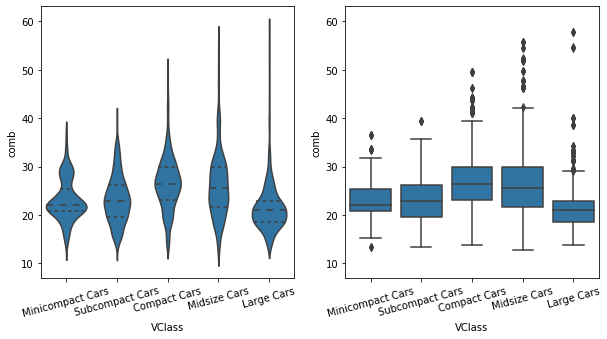


In order to provide a better comparison of the violin and box plots, a `ylim` expression has been added to the second plot to match the two plots' y-axis limits. The Axes object returned by `violinplot` is assigned to a variable, `ax1` is used to programmatically obtain those limit values.

In a box plot, the central line in the box indicates the median of the distribution, while the top and bottom of the box represent the third and first quartiles of the data, respectively. Thus, the height of the box is the interquartile range (IQR). From the top and bottom of the box, the whiskers indicate the range from the first or third quartiles to the minimum or maximum value in the distribution. Typically, a maximum range is set on whisker length; by default this is 1.5 times the IQR.

Comparing the two plots, the box plot is a cleaner summary of the data than the violin plot. It's easier to compare statistics between the groups with a box plot. This makes a box plot worth more consideration if you have a lot of groups to compare, or if you are building explanatory plots. The violin plot may be a better option for exploration, especially since seaborn's implementation also includes the box plot by default.

### Additional Variations

As with `violinplot`, `boxplot` can also render horizontal box plots by setting the numeric and categorical features to the appropriate arguments.


```python
sb.boxplot(data = fuel_econ, x = 'comb', y = 'VClass', color = base_color);
```


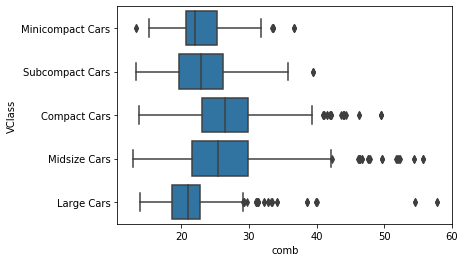


In `violinplot`, there is an additional option for plotting summary statistics in the violin, beyond the default mini box plot. By setting `inner = 'quartile'`, three lines will be plotted within each violin area for the three middle quartiles. The line with thick dashes indicates the median, and the two lines with shorter dashes on either side the first and third quartiles.


```python
sb.violinplot(data = fuel_econ, x = 'VClass', y = 'comb', color = base_color, inner = 'quartile');
plt.xticks(rotation = 15);
```


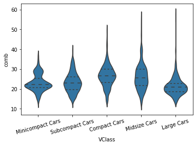


### Clustered Bar Charts

To depict the relationship between two categorical variables, we can extend the univariate bar chart into a clustered bar chart. Like a standard bar chart, we still want to depict the count of data points in each group, but each group is now a combination of labels on two variables. So we want to organize the bars into an order that makes the plot easy to interpret. In a clustered bar chart, bars are organized into clusters based on levels of the first variable, and then bars are ordered consistently across the second variable within each cluster. This is easiest to see with an example, using seaborn's `countplot` function. To take the plot from univariate to bivariate, we add the second variable to be plotted under the "hue" argument:


```python
fuel_econ['trans_type'] = fuel_econ['trans'].apply(lambda x: x.split()[0])
```


```python
ct_counts = fuel_econ.groupby(['VClass', 'trans_type']).size()
ct_counts
```


    VClass            trans_type
    Minicompact Cars  Automatic     188
                      Manual        133
    Subcompact Cars   Automatic     502
                      Manual        171
    Compact Cars      Automatic     784
                      Manual        338
    Midsize Cars      Automatic     989
                      Manual        199
    Large Cars        Automatic     605
                      Manual         20
    dtype: int64


```python
ct_counts = ct_counts.reset_index(name = 'count')
ct_counts
```


<div>
<style scoped>
    .dataframe tbody tr th:only-of-type {
        vertical-align: middle;
    }

    .dataframe tbody tr th {
        vertical-align: top;
    }

    .dataframe thead th {
        text-align: right;
    }
</style>
<table border="1" class="dataframe">
  <thead>
    <tr style="text-align: right;">
      <th></th>
      <th>VClass</th>
      <th>trans_type</th>
      <th>count</th>
    </tr>
  </thead>
  <tbody>
    <tr>
      <th>0</th>
      <td>Minicompact Cars</td>
      <td>Automatic</td>
      <td>188</td>
    </tr>
    <tr>
      <th>1</th>
      <td>Minicompact Cars</td>
      <td>Manual</td>
      <td>133</td>
    </tr>
    <tr>
      <th>2</th>
      <td>Subcompact Cars</td>
      <td>Automatic</td>
      <td>502</td>
    </tr>
    <tr>
      <th>3</th>
      <td>Subcompact Cars</td>
      <td>Manual</td>
      <td>171</td>
    </tr>
    <tr>
      <th>4</th>
      <td>Compact Cars</td>
      <td>Automatic</td>
      <td>784</td>
    </tr>
    <tr>
      <th>5</th>
      <td>Compact Cars</td>
      <td>Manual</td>
      <td>338</td>
    </tr>
    <tr>
      <th>6</th>
      <td>Midsize Cars</td>
      <td>Automatic</td>
      <td>989</td>
    </tr>
    <tr>
      <th>7</th>
      <td>Midsize Cars</td>
      <td>Manual</td>
      <td>199</td>
    </tr>
    <tr>
      <th>8</th>
      <td>Large Cars</td>
      <td>Automatic</td>
      <td>605</td>
    </tr>
    <tr>
      <th>9</th>
      <td>Large Cars</td>
      <td>Manual</td>
      <td>20</td>
    </tr>
  </tbody>
</table>
</div>


```python
ct_counts = ct_counts.pivot(index = 'VClass', columns = 'trans_type', values = 'count')
ct_counts
```


<div>
<style scoped>
    .dataframe tbody tr th:only-of-type {
        vertical-align: middle;
    }

    .dataframe tbody tr th {
        vertical-align: top;
    }

    .dataframe thead th {
        text-align: right;
    }
</style>
<table border="1" class="dataframe">
  <thead>
    <tr style="text-align: right;">
      <th>trans_type</th>
      <th>Automatic</th>
      <th>Manual</th>
    </tr>
    <tr>
      <th>VClass</th>
      <th></th>
      <th></th>
    </tr>
  </thead>
  <tbody>
    <tr>
      <th>Minicompact Cars</th>
      <td>188</td>
      <td>133</td>
    </tr>
    <tr>
      <th>Subcompact Cars</th>
      <td>502</td>
      <td>171</td>
    </tr>
    <tr>
      <th>Compact Cars</th>
      <td>784</td>
      <td>338</td>
    </tr>
    <tr>
      <th>Midsize Cars</th>
      <td>989</td>
      <td>199</td>
    </tr>
    <tr>
      <th>Large Cars</th>
      <td>605</td>
      <td>20</td>
    </tr>
  </tbody>
</table>
</div>


```python
sb.countplot(data = fuel_econ, x = 'VClass', hue = 'trans_type')
plt.xticks(rotation = 15);
```


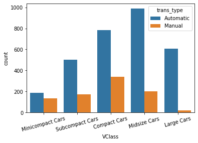


We can change the legend position if we need to. We can use an `Axes method` to set the legend properties on the Axes object returned from `countplot`.


```python
ax = sb.countplot(data = fuel_econ, x = 'VClass', hue = 'trans_type')
ax.legend(loc = 8, ncol = 2, framealpha = 0.6, title = 'trans_type')
plt.xticks(rotation = 15);
```


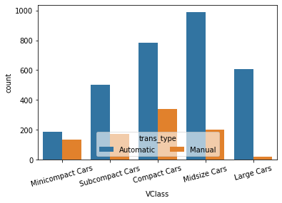


### Alternative Approach (Heat Map)

One alternative way of depicting the relationship between two categorical variables is through a heat map. The seaborn function `heatmap` is at home with this type of heat map implementation. Instead of providing the original dataframe, we need to summarize the counts into a matrix that will then be plotted.


```python
sb.heatmap(ct_counts, annot = True, fmt = 'd');
```


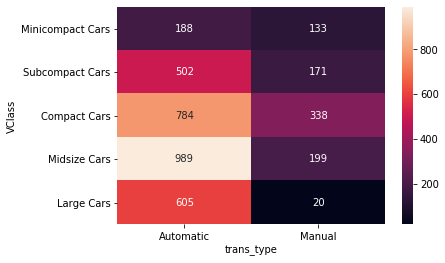


`annot = True` makes it so annotations show up in each cell, but the default string formatting only goes to two digits of precision. Adding `fmt = 'd'` means that annotations will all be formatted as integers instead. You can use `fmt = '.0f'` if you have any cells with no counts, in order to account for NaNs.

### Faceting

One general visualization technique that will be useful to handle plots of two or more variables is faceting. In faceting, the data is divided into disjoint subsets, most often by different levels of a categorical variable. For each of these subsets of the data, the same plot type is rendered on other variables. Faceting is a way of comparing distributions or relationships across levels of additional variables, especially when there are three or more variables of interest overall.

Seaborn's `FacetGrid` class facilitates the creation of faceted plots. There are two steps involved in creating a faceted plot. First, we need to create an instance of the `FacetGrid` object and specify the feature we want to facet by ("VClass" in our example). Then we use the `map` method on the `FacetGrid` object to specify the plot type and variable(s) that will be plotted in each subset (in this case, histogram on "comb").


```python
g = sb.FacetGrid(data = fuel_econ, col = 'VClass');
g.map(plt.hist, 'comb');
```


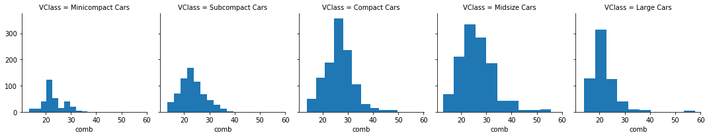


In the `map` call, just set the plotting function and variable to be plotted as positional arguments. 

Each subset of the data is being plotted independently. Each uses the default of ten bins from `hist` to bin together the data, and each plot has a different bin size. Despite that, the axis limits on each facet are the same to allow clear and direct comparisons between groups. We can set the same bin edges on all facets. Extra visualization parameters can be set as additional keyword arguments to the `map` function.

Setting `col_wrap = 3` means that the plots will be organized into rows of three facets each.


```python
bins = np.arange(12, 58+2, 2)
g = sb.FacetGrid(data = fuel_econ, col = 'VClass', col_wrap = 3);
g.map(plt.hist, 'comb');
```


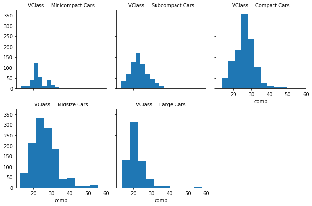


```python
bins = np.arange(12, 58+2, 2)
g = sb.FacetGrid(data = fuel_econ, col = 'VClass', col_wrap = 3, sharey = False);
g.map(plt.hist, 'comb');
```


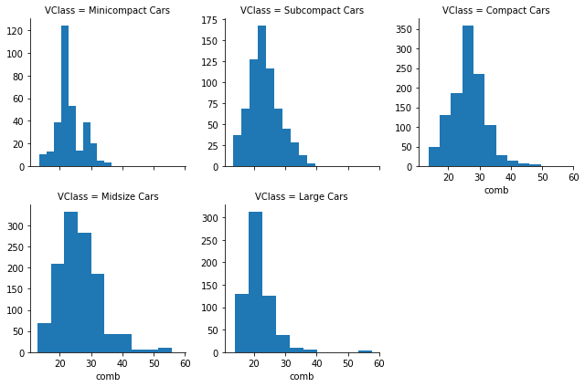


Other operations may be performed to increase the immediate readability of the plots: setting each facet height to 2 inches ("size"), sorting the facets by group mean ("col_order"), limiting the number of bin edges, and changing the titles of each facet to just the categorical level name using the `set_titles` method and `{col_name}` template variable.

### Adapted Bar Charts

Histograms and bar charts can be adapted for use as bivariate plots by, instead of indicating count by height, indicating a mean or other statistic on a second variable.

For example, we could plot a numeric variable against a categorical variable by adapting a bar chart so that its bar heights indicate the mean of the numeric variable. This is the purpose of seaborn's `barplot` function:


```python
base_color = sb.color_palette()[0]
sb.barplot(data = fuel_econ, x = 'VClass', y = 'comb', color = base_color);
plt.xticks(rotation = 15);
plt.ylabel('Avg. Combined Fuel Eff. (mpg)');
```


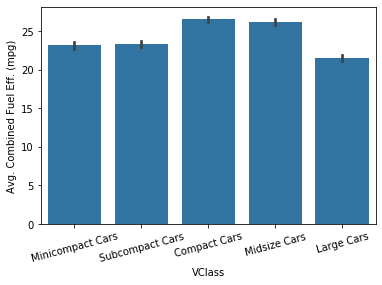


The bar heights indicate the mean value on the numeric variable, with error bars plotted to show the uncertainty in the mean based on variance and sample size. 

As an alternative, the `pointplot` function can be used to plot the averages as points rather than bars. This can be useful if having bars in reference to a 0 baseline aren't important or would be confusing.


```python
sb.pointplot(data = fuel_econ, x = 'VClass', y = 'comb', ci = 'sd');
plt.xticks(rotation = 15);
```


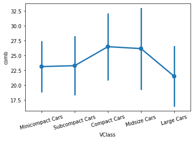


By default, pointplotwill connect values by a line. This is fine if the categorical variable is ordinal in nature, but it can be a good idea to remove the line via `linestyles = ""` for nominal data.


```python
sb.pointplot(data = fuel_econ, x = 'VClass', y = 'comb', ci = 'sd', linestyles = '');
plt.xticks(rotation = 15);
```


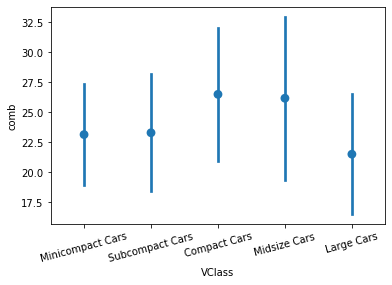


The above plots can be useful alternatives to the box plot and violin plot if the data is not conducive to either of those plot types. For example, if the numeric variable is binary in nature, taking values only of 0 or 1, then a box plot or violin plot will not be informative, leaving the adapted bar chart as the best choice for displaying the data.


```python
plt.figure(figsize = [12, 5])

# left plot: violin plot
plt.subplot(1, 3, 1)
sb.violinplot(data = fuel_econ, x = 'VClass', y = 'comb', inner = None,
              color = base_color)
plt.xticks(rotation = 15)

# center plot: box plot
plt.subplot(1, 3, 2)
sb.boxplot(data = fuel_econ, x = 'VClass', y = 'comb', color = base_color)
plt.xticks(rotation = 15)

# right plot: adapted bar chart
plt.subplot(1, 3, 3)
sb.barplot(data = fuel_econ, x = 'VClass', y = 'comb', color = base_color)
plt.xticks(rotation = 15);
```


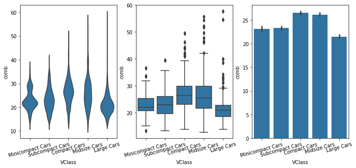


### Line Plots

The line plot is a fairly common plot type that is used to plot the trend of one numeric variable against values of a second variable. In contrast to a scatterplot, where all data points are plotted, in a line plot, only one point is plotted for every unique x-value or bin of x-values (like a histogram). If there are multiple observations in an x-bin, then the y-value of the point plotted in the line plot will be a summary statistic (like mean or median) of the data in the bin. The plotted points are connected with a line that emphasizes the sequential or connected nature of the x-values.

If the x-variable represents time, then a line plot of the data is frequently known as a time series plot. Often, we have only one observation per time period, like in stock or currency charts. 

We will make use of Matplotlib's `errorbar` function, performing some processing on the data in order to get it into its necessary form.


```python
plt.errorbar(data = fuel_econ, x = 'displ', y = 'comb');
plt.xlabel('Displacement (l)');
plt.ylabel('Avg. Combined Fuel Eff. (mpg)');
```


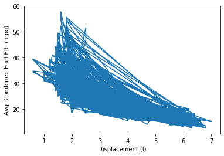


If we just blindly stick a dataframe into the function without considering its structure, we might end up with a mess like the above. The function just plots all the data points as a line, connecting values from the first row of the dataframe to the last row. In order to create the line plot as intended, we need to do additional work to summarize the data.


```python
bins_e = np.arange(0.6, 7 + 0.2, 0.2)
bins_c = bins_e[:-1] + 0.1
displ_binned = pd.cut(fuel_econ['displ'], bins_c, include_lowest = True)
displ_binned.head()
```


    0    (3.7, 3.9]
    1    (1.9, 2.1]
    2    (3.5, 3.7]
    3    (3.5, 3.7]
    4    (2.3, 2.5]
    Name: displ, dtype: category
    Categories (31, interval[float64]): [(0.699, 0.9] < (0.9, 1.1] < (1.1, 1.3] < (1.3, 1.5] ... (6.1, 6.3] < (6.3, 6.5] < (6.5, 6.7] < (6.7, 6.9]]


```python
comb_mean = fuel_econ['comb'].groupby(displ_binned).mean()
comb_mean.head()
```


    displ
    (0.699, 0.9]          NaN
    (0.9, 1.1]      33.469158
    (1.1, 1.3]      36.767192
    (1.3, 1.5]      32.101316
    (1.5, 1.7]      29.370004
    Name: comb, dtype: float64


The following code does not work on my computer. So I put it into markdown cells.

plt.errorbar(x = bins_e, y = comb_mean)

plt.xlabel('Displacement (l)');

plt.ylabel('Avg. Combined Fuel Eff. (mpg)');

comb_std = fuel_econ['comb'].groupby(displ_binned).std()

plt.errorbar(x = bins_c, y = comb_mean, yerr = comb_std);

### Alternate Variations

Instead of computing summary statistics on fixed bins, you can also make computations on a rolling window through use of pandas' `rolling` method. Since the rolling window will make computations on sequential rows of the dataframe, we should use `sort_values` to put the x-values in ascending order first.


```python

```
